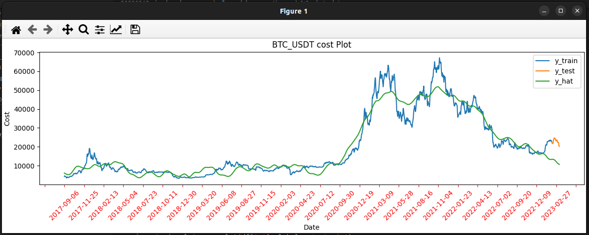
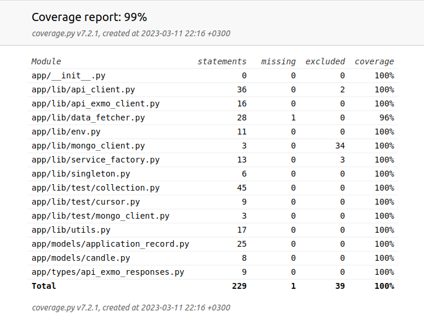

&nbsp;
&nbsp;
&nbsp;
# Simple Machine Learning Pipeline

This application implements the simplest pipeline, including:
  - CI - continious integration;
  - CD - continious deployment;
  - CT - continious training;

## Working in Jenkins
You can run all pipeline steps in Jenkins. See [here](./docs/pipeline_with_jenkins.md) an instructions.

## A complete iteration consists of the following operations:
1. Receiving new data from a third-party API - obtaining information about candles for a particular instrument: maximum and minimum prices, as well as opening and closing prices;
2. Pre-processing of data received in the API - for each candle, the average value is calculated, between the maximum and minimum prices for the candle;
3. Saving new data in the data warehouse. The key for the record is the timestamp, and the value is the average price of the instrument per candle;
4. The model is retrained according to the newly obtained values. In this case, before training, the previously obtained weights of the model are loaded from the storage;
5. The quality of the model training is assessed;

### Getting new data from a third party API:
* First, a time limit is determined, before which information on candlesticks has already been obtained in previous iterations;

* One or more requests are made to the API for fresh data;

### Pre-processing of data received in the API
Before storing the data in the storage, they are preliminarily prepared. For each candle, the average value is calculated, according to its maximum and minimum values. Thus, each moment of time in the data corresponds to one number - the average value of the candle for a time interval equal to the difference between the current and previous moments.

### Saving new data in the data warehouse
Data is saved to the key-value database so that each candlestick has one record with timestamp `ds` and one numeric value `y`.

### Training of the model
The first time we train the model on all available data.
After replenishing the time series, each time we retrain the model, adding to the time series used in previous iterations, a small part of the fresh data in comparison. With each such training, the model is restored from previously saved settings, retrained, and its settings are saved for subsequent iterations.

## Application settings
The application has several environments. For development, this environment is called development. For testing - test. For a working server, this environment is called production.
All development environment settings are described in the ./.env file.
You would to copy file ./.env.example to ./.env for first time in your local development environment and customize settings.

## Run application

### In development mode
1. In development mode you would to use dockerized services. To run all of them use:
```bash
docker-compose up
```

or, if you want to daemonize it:
```bash
docker-compose up -d
```

Also, you can stop all services:
```bash
docker-compose stop
```

2. When dockerized storage is running, you can run all ml pipeline:
```bash
./pipeline.sh
```

Or, you can run each pipeline step separately:

2.1. Collect data for time series:
```bash
python data_creation.py
```

2.2. After data collected, prepare `y` values:
```bash
python model_preprocessing.py
```

2.3. After `y` value ready, prepare model:
```bash
python model_preparation.py
```
At the end of this step you can see the chart, like this:


2.4. After model prepared, test it:
```bash
python model_testing.py
```

## Continious Integration

There are several types of checks that should be run before submitting code to make sure everything is fine.

### Linters

To run pylint:

```bash
./scripts/run_pylint
```

### Unit testing

To run unit tests:

```bash
./scripts/run_pytest
```

### Code coverage

In development environment you can check an [html coverage report](./coverage/report/index.html)
Its look like this: 

In github - see the latest action, for example [this](https://github.com/bsa7/SimpleMLPipeline/actions/runs/4392188767)

## Jenkins

In development mode run docker-compose, as shown above and visit local addres: `http://0.0.0.0:3080/`
User: Admin
Password: 123

