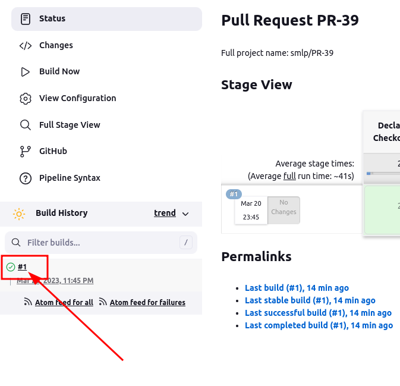

# Pipeline with Jenkins
In Development mode.

1. Install Jenkins by [instruction](https://www.digitalocean.com/community/tutorials/how-to-install-jenkins-on-ubuntu-20-04):

2. Create new pipeline:

  2.1. Add new item:
  

  2.2. Fill field 'Item name', select 'multibranch pipeline' and press ok:
  

  2.3. Fill 'Display Name', 'Description' fields and press 'Add source' in 'Branch Sources block':
  

  2.4. Select type 'GitHub' and fill username of your github account and fill 'Password' field with personal access token, created only for access jenkins to this repo:
  
  Press button 'Add' and select type of branches, used in pipeline:

  

  2.5. Press 'Save' button in bottom of page. All is ready:

3. Visit dashboard page: [http://0.0.0.0:8080](http://0.0.0.0:8080)
You'll see created pipeline, named 'smlp':

4. Visit pipeline page (click on it link):

5. See the stages:

6. All stages placed in [Jenkinsfile](../Jenkinsfile) in root of repository.

7. To see the logs, press here:

and press 'Console output':

You would see logs of each stage:

