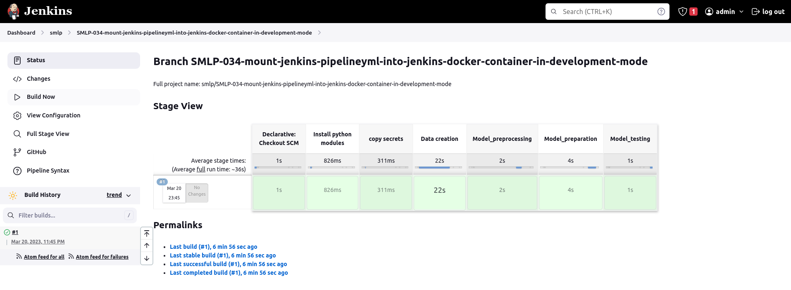

# Pipeline with Jenkins
In Development mode.

1. Run Jenkins in docker:
```bash
docker-compose up
```

At first run you not need to daemonize docker-compose, because jenkins show you temporary pasword:
```bash
jenkins_1  |
jenkins_1  | Jenkins initial setup is required. An admin user has been created and a password generated.
jenkins_1  | Please use the following password to proceed to installation:
jenkins_1  |
jenkins_1  | 173ef2c01d75408482e1b72478af2073
jenkins_1  |
jenkins_1  | This may also be found at: /var/jenkins_home/secrets/initialAdminPassword
jenkins_1  |
jenkins_1  | *************************************************************
jenkins_1  | *************************************************************
jenkins_1  | *************************************************************
```

Copy that password to clipboard.

2. Open Jenkins in brovser. Visit address [http://0.0.0.0:8080/](http://0.0.0.0:8080/), you must see initialization screen:


Paste password in 'Administrator password' field and press 'Continue'.

3. Press button "Install suggested plugins" as shown here:


4. Be patience, wait while all plugins are installed:


5. For working with repo, create your personal access token:

    5.1. Visit [https://github.com/settings/tokens](https://github.com/settings/tokens) and press 'Generate new token (classic)' as shown below:

    

    5.2. Check 'repo' checkbox and enter name of token as show on image:

    

    5.3. Press green button 'Generate token' at bottom of page.

    5.4. Copy secret token to clipboard:

    

6. Return to Jenkins [http://0.0.0.0:8080/](http://0.0.0.0:8080/) and fill the form:
  

  Follow next page without changes. Press bottom right button and button "Start using Jenkins" in final:

  

7. Create new pipeline:

  7.1. Add new item:
  

  7.2. Fill field 'Item name', select 'multibranch pipeline' and press ok:
  

  7.3. Fill 'Display Name', 'Description' fields and press 'Add source' in 'Branch Sources block':
  

  7.4. Select type 'GitHub' and fill username of your github account and fill 'Password' field with token, copied on step 5.4.:
  
  Press button 'Add' and select type of branches, used in pipeline:

  

  7.5. Press 'Add' button in bottom of page. All is ready:

8. Visit dashboard page: [http://0.0.0.0:8080](http://0.0.0.0:8080)
You'll see created pipeline, named 'smlp':


9. Visit pipeline page (click on it link):


10. See the stages:


11. All stages placed in [Jenkinsfile](../Jenkinsfile) in root of repository.

12. To see the logs, press here:

and press 'Console output':

You would see logs of each stage:


